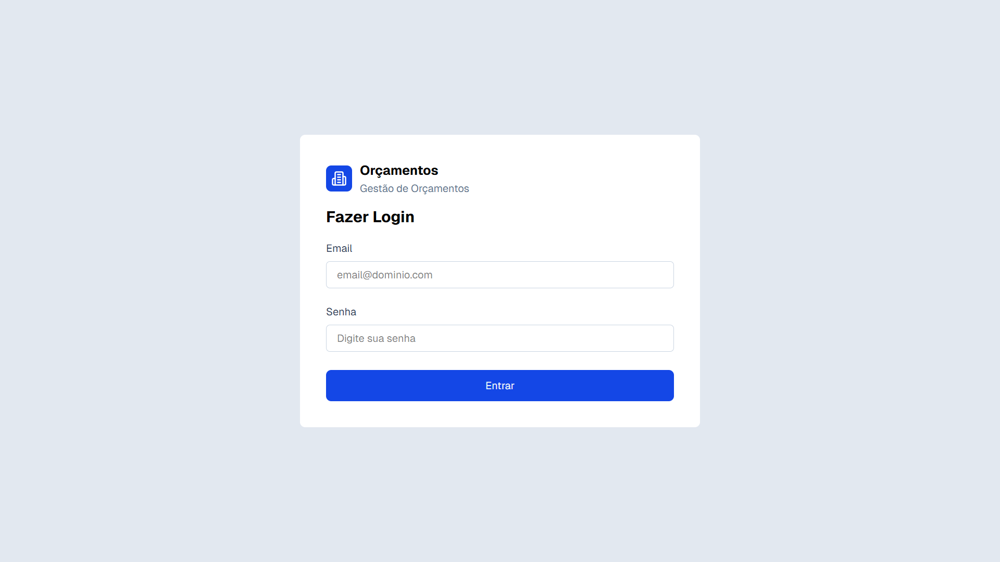
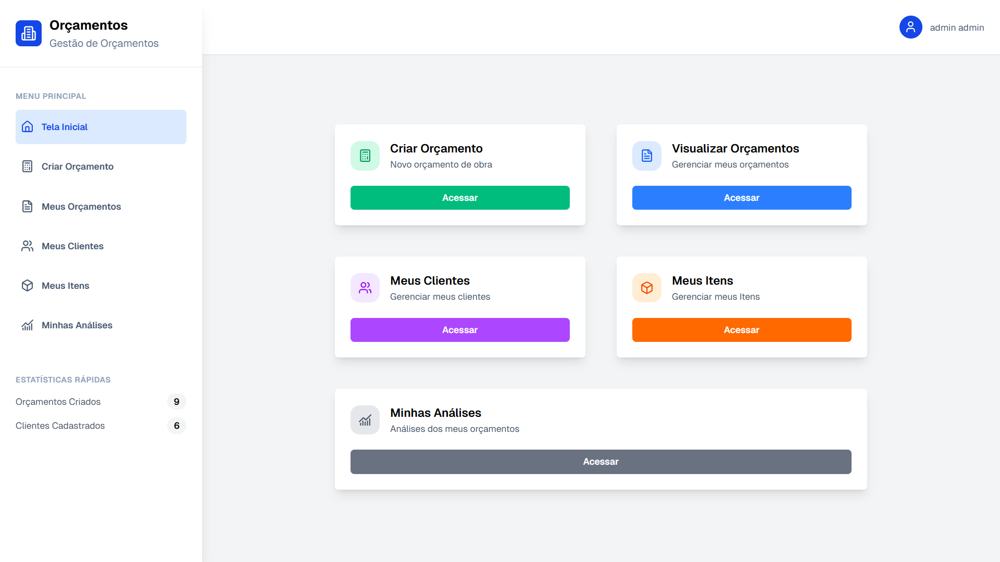
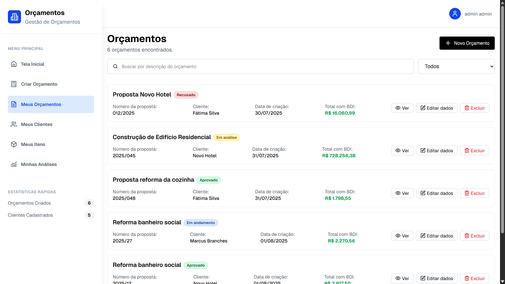
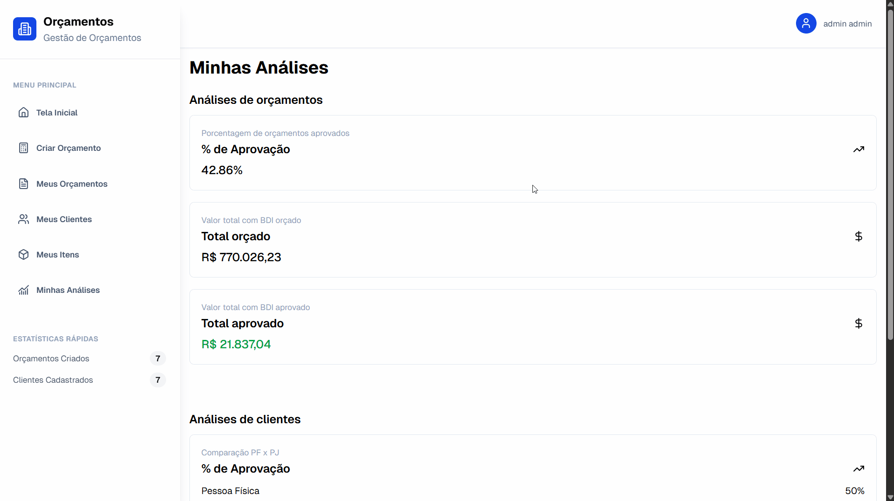
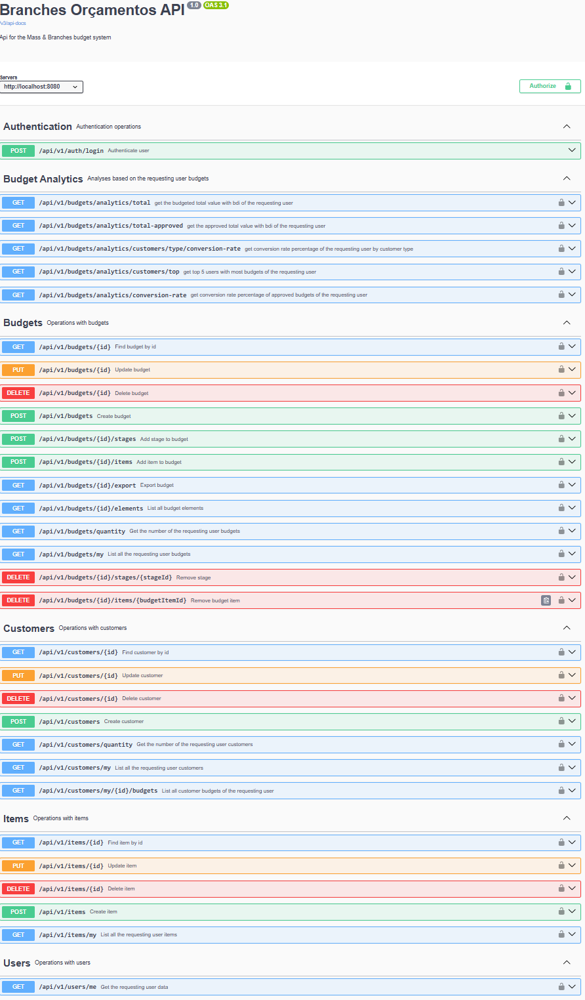

# Branches Orçamentos

> Sistema web para criação, auditoria e gestão de orçamentos da construção civil 

---

## 📚 Sumário

- [✍️ Motivação](#-motivação)
- [🎯 Funcionalidades atuais](#-funcionalidades-atuais-)
- [📸 Demonstração](#-demonstração)
- [📖 Documentação da API](#-documentação-da-api)
- [🛠️ Tecnologias utilizadas](#-tecnologias-utilizadas)
- [🖥️ Como rodar na sua máquina](#-como-rodar-na-sua-máquina)
- [🚀 Utilizando o sistema](#-utilizando-o-sistema)

---


## ✍️ Motivação

Durante os meus primeiros estudos com Java, desenvolvi um aplicativo desktop para criação de orçamentos simples, utilizando a tabela SINAPI como base. Ao apresentar o projeto a um familiar engenheiro civil, ele demonstrou bastante interesse na ideia. No entanto, identificamos diversos pontos a melhorar e recursos ausentes. A partir disso, estou trabalhando no desenvolvimento de uma versão web mais robusta, pensada para uso no dia a dia desse familiar.

## 🎯 Funcionalidades atuais 

- Criação de orçamentos 
- Divisão dos orçamentos em etapas
- Cálculo automático de valor total por etapa
- Definição de status do orçamento (em andamento, em análise, aprovado ou recusado)
- Cálculos de orçamentos com ou sem bdi
- Listagem de todos orçamentos
- Filtro de orçamentos por status
- Exportação de orçamento para a planilha de proposta da empresa
- Criação automática de item ao ser utilizado em um orçamento
- Criação de clientes
- Visualização de orçamentos de cada cliente
- Filtro de clientes por tipo
- Criação de itens
- Visualização de itens
- Quantidade de uso por item
- Análise avançadas:
  - Taxa de conversão de orçamentos
  - Taxa de conversão por tipo de cliente
  - Rank de clientes com mais orçamentos
  - Valor total orçado
  - Valor total aprovado

## 📸 Demonstração

### 🔒 Tela de login



### ▶️ Tela inicial do sistema



---

### 🧾 Criação de orçamento


---

### 📋 Listagem de orçamentos



---

### 📤 Exportação para arquivo de proposta da Empresa


---

### 👥 Listagem de clientes


---

### 📑 Listagem de orçamentos por cliente


---

### 🧱 Listagem de itens


---

### 📈 Análises



---

## 📖 Documentação da API
 
> A API está completamente documentada, para visitar a documentação basta acessar a url `http://localhost:8080/swagger-ui.html`



## 🛠️ Tecnologias utilizadas

- Backend
  -  - Linguagem de programação utilizada.
  -  - Framework para criação da APIs REST em Java.
  -  - Framework para mapeamento objeto-relacional.
  -  - Implementação da autenticação e autorização com JWT.
  -  - Documentação da API com Swagger UI.
  -  - Ferramenta para versionamento do banco de dados.
  -  - Framework ORM para persistência de dados.
  -  - Para conteinerização do Banco de dados.
  -  - Banco de dados utilizado.
  -  - Para gerenciar dependências e automação de builds.
- Frontend
  -  - Linguagem de programação utilizada.
  -  - Biblioteca para criação de interfaces.
  -  - Framework CSS utilizado para estilizar os components.
  -  - Ferramenta de build.

## 🖥️ Como rodar na sua máquina

### 1. Configurar as variáveis de ambiente

#### a. **Variável Docker (`backend`)**

- Navegue até o diretório `backend`.
- Renomeie o arquivo `.envTemplate` para `.env` e preencha a variável com o valor desejado para o seu ambiente de desenvolvimento.

#### b. **Variáveis Spring Boot (`backend/src/main/resources`)**

- Navegue até o diretório `src/main/resources` do módulo `backend`.
- Renomeie o arquivo `.envTemplate` para `.env`
- Obs: `ENV_MYSQL_PASSWORD` deve ser igual ao definido no `.env` na raíz do projeto.

### 2. Rodar Docker

- A partir da raíz do repositório rodar os seguintes comandos:
    ```
      cd backend
      docker-compose up -d
    ```
  
### 3. Inicializar o Backend

- De dentro do módulo backend rodar o seguinte comando:
    ```
      mvn spring-boot:run
    ```
- Obs: ao inicializar, um usuário com as seguintes credenciais será criado:
  ```
    email: admin@admin.com 
    senha: 123
  ```
  

### 4. Inicializar o Frontend

- A partir da raíz do repositório rodar os seguintes comandos:
    ```
      cd frontend
      npm run dev
    ```

## 🚀 Utilizando o sistema

- Acesse `http://localhost:5173/login` para acessar ao sistema e ter acesso a todas as suas funcionalidades
